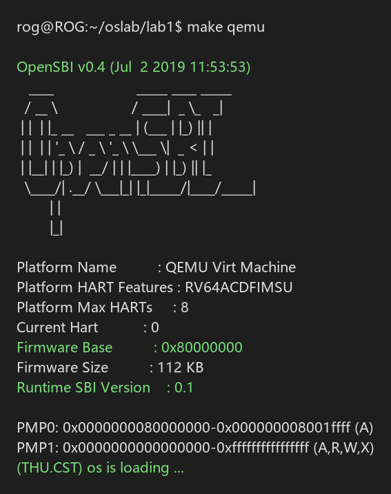
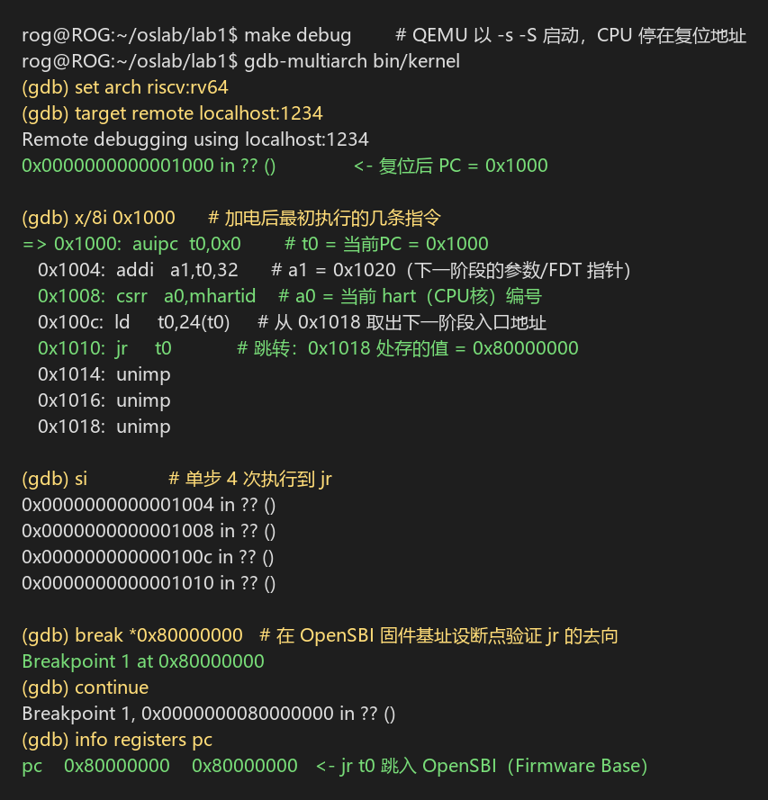
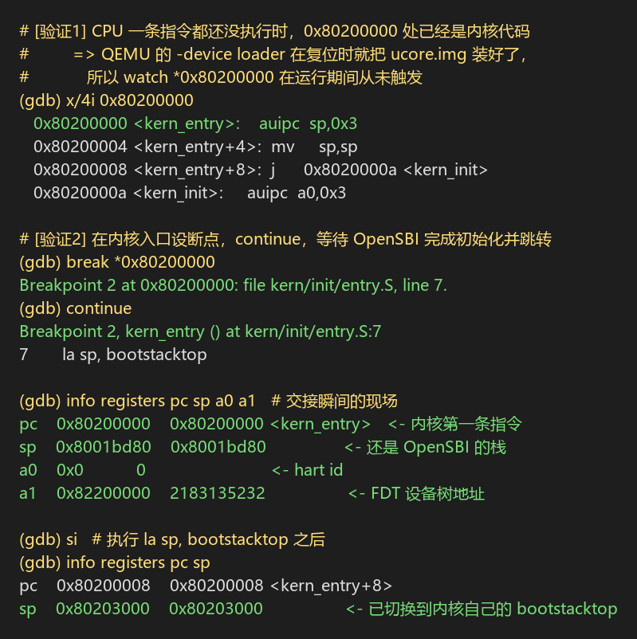

# 实验报告

## 实验基本信息

| 项目 | 内容 |
|------|------|
| **实验名称** | Lab 1: 比麻雀更小的麻雀（最小可执行内核） |
| **小组成员** | 2510670-刘晋豪（组长）、2512739-徐乙涵、2510547-李佩霖 |
| **完成日期** | 2026-10-07 |

### 小组分工

| 成员 | 负责的练习/模块 |
|------|----------------|
| 2510670-刘晋豪 | 实验环境搭建与修复（QEMU 4.1.1 源码编译）、练习1 |
| 2510547-李佩霖 | 练习2（GDB 启动流程追踪）、AI 交互记录（prompt.md）汇总 |
| 2512739-徐乙涵 | 实验报告整理与测试验证 |

---

## 一、实验目的

本实验的主要目的是：

1. 理解 RISC-V 计算机从加电到操作系统内核开始执行的完整启动流程（QEMU 复位代码 → OpenSBI 固件 → 内核）；
2. 掌握使用链接脚本描述内存布局、通过交叉编译生成内核镜像的方法；
3. 理解 OpenSBI 作为 bootloader 的作用，以及如何通过 SBI 调用在屏幕上格式化输出字符串；
4. 熟练使用 GDB 远程调试 QEMU 模拟的 RISC-V 系统，用调试手段验证启动流程的每个阶段。

---

## 二、实验环境

你们使用的 AI 工具

| 成员 | AI 编程工具 | 底层模型 |
|------|------------|---------|
| 2510547-李佩霖 | Kimi Code | Kimi K3|
| 2510670-刘晋豪 | Codex | GPT 6 |
| 2512739-徐乙涵 | Codex | GPT 6 |

**系统与工具链环境：**

| 项目 | 版本 |
|------|------|
| 宿主机 | Windows 11 + WSL2（Ubuntu 24.04） |
| 交叉编译器 | riscv64-unknown-elf-gcc 13.2.0 |
| 模拟器 | QEMU 4.1.1（从源码编译，`--target-list=riscv64-softmmu,riscv32-softmmu`） |
| 固件 | QEMU 4.1.1 内置 OpenSBI v0.4（Runtime SBI Version 0.1） |
| 调试器 | gdb-multiarch 15.1 |
| 构建工具 | GNU Make 4.3 |

---

## 三、实验整体逻辑分析

### 3.1 本章节的逻辑主线

本章围绕一个核心问题展开：**一个最小的操作系统内核，是如何在一台（被 QEMU 模拟出来的）RISC-V 计算机上跑起来的？**

为了回答这个问题，实验把"启动"这件事拆成了一条接力链：CPU 加电后先执行固化在复位地址的初始代码，再由 OpenSBI 固件完成硬件初始化，最后把控制权交给放在约定地址的内核镜像。内核自身则依赖链接脚本约定的内存布局才能被正确加载，依赖 SBI 提供的服务才能完成最原始的"打印"动作。

### 3.2 功能的逐步实现

1. 首先理解**启动流程**（从机器启动到操作系统运行）→ 因为这是内核运行的前提：不搞清楚"谁把内核放进内存、谁第一个跳过来"，后面的一切都无从谈起；
2. 接着理解**内存布局与链接脚本**（OpenSBI、bin/elf、入口点）→ 因为内核必须被链接到 OpenSBI 约定的地址 `0x80200000`，ELF 可执行文件格式正是编译器与加载者之间的"分布表"约定；
3. 然后实现**从 SBI 到 stdio** → 因为内核刚启动时没有任何驱动，只能借助 OpenSBI 提供的控制台服务完成输出，这是后续所有调试手段的基础；
4. 最后通过 **make 构建 + GDB 调试**把整条链路亲手验证一遍 → 因为"理论上应该这样"和"实际就是这样"之间，只有调试器能给出证据。

---

## 四、实验内容与实现

##### 第一次迭代

**遇到的问题：**
- 问题1：最初直接使用 Ubuntu apt 源安装的 QEMU 8.2.2，lab1 代码可以正常编译（生成 `bin/kernel` 与 `bin/ucore.img`），但 `make qemu` 运行时 OpenSBI 打印完横幅后，内核**没有任何输出**，预期字符串 `(THU.CST) os is loading ...` 不出现。

**原因分析（与 AI 协作定位）：**
- lab1 的 `libs/sbi.c` 使用的是**旧版 SBI v0.1 规范**的控制台调用（`SBI_CONSOLE_PUTCHAR`，EID=1）；
- QEMU 8.2.2 自带的 OpenSBI v1.3 已经移除了这套 legacy SBI v0.1 扩展，内核对控制台 `ecall` 的调用被固件拒绝，字符打不出来；
- 这正是指导书和课程视频反复强调"**不要用 apt 源安装 QEMU，必须下载指定版本源码编译**"的原因。

**问题解决策略：**
- 按指导书从源码编译 QEMU 4.1.1：

```bash
wget https://download.qemu.org/qemu-4.1.1.tar.xz
tar xvJf qemu-4.1.1.tar.xz
cd qemu-4.1.1
./configure --target-list=riscv64-softmmu,riscv32-softmmu --disable-werror
make -j$(nproc)
make install
```

- 将 QEMU 4.1.1 的 `bin` 目录加入 PATH（并建立 `/usr/local/bin` 软链接保证所有 shell 默认使用）。

##### 第二次迭代

**最终结果：**

- ✅ 编译通过（`make` 生成 `bin/kernel`、`bin/ucore.img`）
- ✅ `make qemu` 输出与指导书一致：`OpenSBI v0.4`、`Firmware Base : 0x80000000`、`Runtime SBI Version : 0.1`，随后内核打印 `(THU.CST) os is loading ...`
- ✅ 功能符合预期

**关键改进点总结：**
1. 系统软件实验对**工具链版本**高度敏感：模拟器/固件版本决定了 SBI 等底层接口的可用性，"能跑"和"按规范跑"是两回事；
2. 遇到问题先定位接口契约（SBI 规范版本），再决定是改代码还是改环境——本实验的正确做法是按课程约定固定环境（QEMU 4.1.1 + OpenSBI v0.4），而不是修改内核去适配新固件。

---

### 练习1：理解内核启动中的程序入口操作

**负责人：** 2510670-刘晋豪

阅读 `kern/init/entry.S`：

```asm
kern_entry:
    la sp, bootstacktop
    tail kern_init

.section .data
    .align PGSHIFT
    .global bootstack
bootstack:
    .space KSTACKSIZE
    .global bootstacktop
bootstacktop:
```

**`la sp, bootstacktop` 完成了什么操作，目的是什么？**

- **操作**：把符号 `bootstacktop` 的地址装入栈指针寄存器 `sp`。`bootstack` 是在 `.data` 段中按页对齐（`.align PGSHIFT`，即 4KB）预留的一块 `KSTACKSIZE`（2 页 × 4KB = **8KB**）的静态内存，`bootstacktop` 是这块内存末尾的下一个地址。
- **目的**：为内核**建立第一个属于自己的运行时栈**。RISC-V 的栈是向低地址增长的，所以栈指针要初始化为栈空间的**顶部**。内核接下来要执行 C 代码，函数调用、局部变量、寄存器保存都依赖一个可用的栈；而刚接手控制权时 `sp` 里还是 OpenSBI 的栈（我们用 GDB 观察到此时 `sp = 0x8001bd80`，位于固件区域），内核不能也不应继续借用固件的栈。
- **GDB 验证**：在 `0x80200000` 单步执行该指令后，`sp` 从 `0x8001bd80` 变为 `0x80203000`（= 内核基址 `0x80200000` + 0x3000，正好是 `bootstacktop` 的链接地址），证明栈切换确实发生。

**`tail kern_init` 完成了什么操作，目的是什么？**

- **操作**：`tail` 是 RISC-V 的尾调用伪指令，等价于 `jal x0, kern_init`——**直接跳转**到 `kern_init`，不保存返回地址（不写 `ra`）。
- **目的**：把 CPU 控制权**永久移交**给 C 语言编写的内核初始化函数 `kern_init`。之所以用尾调用而不是普通调用（`call`/`jal ra`），是因为 `kern_init` 被声明为 `noreturn`（其末尾是 `while(1);`），永远不会返回到汇编入口；不保存返回地址意味着 `kern_entry` 不占栈帧、没有"返回"语义，控制权交接是单向的。这与启动流程的整体设计一致：复位代码 → OpenSBI → 内核，每一级都是单向接力。

---

### 练习2：使用 GDB 验证启动流程

**负责人：** 2510547-李佩霖

**调试方法**：一个终端执行 `make debug`（QEMU 以 `-s -S` 参数启动：在 1234 端口开启 GDB stub，且 CPU 停在复位地址不执行），另一个终端用 `gdb-multiarch bin/kernel` 执行 `set arch riscv:rv64` 后 `target remote localhost:1234` 接入调试。

**调试过程与观察结果：**

**① 复位瞬间：PC = 0x1000**

连接 GDB 时 CPU 停在 `0x1000`，即 QEMU virt 机器的**复位地址**。反汇编得到加电后最初执行的几条指令：

```asm
0x1000:  auipc  t0,0x0       # t0 = 当前 PC = 0x1000
0x1004:  addi   a1,t0,32     # a1 = 0x1020（指向下一阶段的参数/设备树信息）
0x1008:  csrr   a0,mhartid   # a0 = 当前 hart（CPU 核）编号
0x100c:  ld     t0,24(t0)    # 从 0x1018 取出下一阶段入口地址
0x1010:  jr     t0           # 跳转到该地址（即 OpenSBI 基址 0x80000000）
```

这段位于 `0x1000` 的代码是 QEMU 内置的复位代码（相当于真实硬件 ROM 中的初始固件）。它完成的功能是：**读取当前 CPU 核编号（mhartid）放入 a0、把参数/设备树指针放入 a1（按 RISC-V 固件接口约定传递参数），然后取出存放在 `0x1018` 处的下一阶段（OpenSBI 固件）入口地址并跳转**。在 `0x80000000` 设断点后 `continue` 命中，证实 `jr t0` 确实跳入了 OpenSBI（`Firmware Base : 0x80000000`）。

**② 内核是谁、在何时装入 0x80200000 的？**

按实验提示设置 `watch *0x80200000` 观察"内核加载瞬间"，但**该观察点在之后的运行中从未触发**。进一步验证发现：在 CPU 一条指令都还没执行（仍停在复位地址）时查看 `0x80200000`，那里**已经是内核的第一条指令**了：

```
(gdb) x/4i 0x80200000
   0x80200000 <kern_entry>:    auipc  sp,0x3
   0x80200004 <kern_entry+4>:  mv     sp,sp
   0x80200008 <kern_entry+8>:  j      0x8020000a <kern_init>
```

结论：本实验中内核镜像是由 **QEMU 的 `-device loader,file=...,addr=0x80200000` 参数在机器复位时直接写入内存**的，OpenSBI（fw_jump 模式）并不负责加载内核，它完成硬件初始化后直接跳转到约定地址 `0x80200000`。这正是课上提到的"QEMU 偷懒处理"——真实硬件中这一步应由固件从硬盘读取内核完成。

**③ 控制权交接：OpenSBI → 内核**

在 `0x80200000` 设断点后 `continue`，OpenSBI 完成初始化（终端打印横幅与平台信息）后断点命中：

```
Breakpoint 2, kern_entry () at kern/init/entry.S:7
7       la sp, bootstacktop
(gdb) info registers pc sp a0 a1
pc    0x80200000    0x80200000 <kern_entry>
sp    0x8001bd80    0x8001bd80       <- 仍是 OpenSBI 的栈
a0    0x0           0                <- hart id = 0
a1    0x82200000    2183135232       <- FDT 设备树地址
```

**回答问题：RISC-V 硬件加电后最初执行的几条指令位于什么地址？它们主要完成了哪些功能？**

- **地址**：最初执行的指令位于复位地址 **`0x1000`**（QEMU virt 机器的 ROM 区域）。
- **功能**：这几条指令完成最基础的启动准备——(1) 通过 `csrr a0, mhartid` 获取当前 CPU 核编号作为固件参数；(2) 通过 `addi a1, t0, 32` 准备好下一阶段的参数/设备树指针；(3) 通过 `ld t0, 24(t0)` 从 `0x1018` 处取出下一阶段固件（OpenSBI）的入口地址；(4) 通过 `jr t0` 跳转到 `0x80000000` 的 OpenSBI，完成"复位代码 → 固件"这一级接力。它们解决的是启动链条最底端的问题：CPU 一上电必须有一段**不依赖任何驱动、固定在已知地址**的代码来引导后续一切。

**拓展：与现代笔记本启动流程的对比**

两者遵循同一设计哲学——"固件 → 引导程序 → 操作系统"的三级接力：笔记本上电后 CPU 先执行主板芯片中的 UEFI 固件（对应本实验的复位代码 + OpenSBI），UEFI 完成硬件自检后加载引导程序（如 GRUB），引导程序再把操作系统内核装入内存并移交控制权。本实验只是用 QEMU 的 `-device loader` 把最后一步简化了，核心思想完全一致。

---

## 五、测试与验证

**测试截图：**

`make qemu` 编译运行成功（OpenSBI v0.4 启动后内核打印加载信息）：



GDB 追踪复位阶段（`0x1000` 处的最初指令与单步执行）：



GDB 验证内核加载与控制权交接（`0x80200000` 断点命中、栈指针切换）：



---

## 六、实验总结与收获

### 对操作系统的理解

1. **本实验重要知识点与 OS 原理的对应：**
   - **启动接力链（复位代码→固件→内核）**：对应 OS 原理中的"系统引导（Bootstrapping）"。实验中每一级只做最少的事就把控制权交给下一级，体现了引导过程"逐层初始化、逐层交接"的本质；原理课讲的是概念，实验中我们用 GDB 把每一棒的交接地址都亲眼验证了一遍。
   - **链接脚本与内存布局**：对应原理中的"程序的地址空间与加载"。`kernel.ld` 把内核链接到 `0x80200000`、用 `PROVIDE(edata/end)` 标出 BSS 边界供 `kern_init` 清零，是"编译器与操作系统关于可执行文件的约定"的具体实例。
   - **SBI 调用**：对应原理中的"系统调用/特权级切换"的雏形——内核（S 态）通过 `ecall` 请求固件（M 态）服务，与用户态通过 `ecall` 请求内核服务在机制上完全同构。
2. **原理中重要但本实验未涉及的知识点：** 虚拟内存/页表（本实验直接运行在物理地址上）、中断与异常处理（`ecall` 只作为单向调用出现，没有 trap 返回路径的分析）、进程概念（内核只有一个控制流，跑死循环）。

